# Azure DevOps CI/CD Pipeline for Web Content

This repository contains a comprehensive CI/CD pipeline implementation for web content deployment using Azure DevOps. The pipeline is designed to automate the entire process from code commit to production deployment with proper testing, security checks, and performance monitoring.

## CI/CD Pipeline Visualization

```mermaid
%%{init: {'theme': 'dark', 'themeVariables': { 'background': '#1e1e1e', 'primaryColor': '#2a2a2a' }}}%%
flowchart TB
    subgraph "Development"
        Dev_Commit["Developer Commit"]
        PR["Pull Request"]
        Code_Review["Code Review"]
        Auto_Tests["Automated Tests"]
    end
    
    subgraph "CI Pipeline"
        Build["Build Application"]
        Unit_Tests["Unit Tests"]
        Code_Analysis["Code Analysis\nSonarQube"]
        Sec_Scan["Security Scan"]
        Package["Package\nApplication"]
    end
    
    subgraph "CD Pipeline"
        subgraph "Dev Environment"
            Dev_Deploy["Deploy to Dev"]
            Dev_Tests["Run Tests"]
            Dev_Metrics["Collect Metrics"]
        end
        
        subgraph "Staging Environment"
            Staging_Deploy["Deploy to Staging"]
            E2E_Tests["E2E Tests"]
            Load_Tests["Load Tests"]
            Perf_Tests["Performance Tests\nLighthouse"]
            Stage_Approval["Manual Approval"]
        end
        
        subgraph "Production Environment"
            Prod_Deploy["Deploy to Production"]
            CDN_Purge["Purge CDN"]
            Smoke_Tests["Smoke Tests"]
            Monitoring["Post-Deployment\nMonitoring"]
        end
    end
    
    Dev_Commit --> PR
    PR --> Code_Review
    PR --> Auto_Tests
    Code_Review --> Build
    Auto_Tests --> Build
    
    Build --> Unit_Tests
    Unit_Tests --> Code_Analysis
    Code_Analysis --> Sec_Scan
    Sec_Scan --> Package
    
    Package --> Dev_Deploy
    Dev_Deploy --> Dev_Tests
    Dev_Tests --> Dev_Metrics
    Dev_Metrics --> Staging_Deploy
    
    Staging_Deploy --> E2E_Tests
    E2E_Tests --> Load_Tests
    Load_Tests --> Perf_Tests
    Perf_Tests --> Stage_Approval
    Stage_Approval --> Prod_Deploy
    
    Prod_Deploy --> CDN_Purge
    CDN_Purge --> Smoke_Tests
    Smoke_Tests --> Monitoring
    
    classDef devphase fill:#3B78B6,stroke:#5E9AD1,stroke-width:2px,color:#FFFFFF,font-weight:bold
    classDef ciphase fill:#C78F3C,stroke:#E1A95B,stroke-width:2px,color:#FFFFFF,font-weight:bold
    classDef cdphase fill:#3D9250,stroke:#60AD71,stroke-width:2px,color:#FFFFFF,font-weight:bold
    classDef devenv fill:#336A99,stroke:#5D8BB1,stroke-width:2px,color:#FFFFFF
    classDef stageenv fill:#A03939,stroke:#C15454,stroke-width:2px,color:#FFFFFF
    classDef prodenv fill:#407F40,stroke:#609460,stroke-width:2px,color:#FFFFFF
    
    class Dev_Commit,PR,Code_Review,Auto_Tests devphase
    class Build,Unit_Tests,Code_Analysis,Sec_Scan,Package ciphase
    class Dev_Deploy,Dev_Tests,Dev_Metrics,Staging_Deploy,E2E_Tests,Load_Tests,Perf_Tests,Stage_Approval,Prod_Deploy,CDN_Purge,Smoke_Tests,Monitoring cdphase
    class Dev_Deploy,Dev_Tests,Dev_Metrics devenv
    class Staging_Deploy,E2E_Tests,Load_Tests,Perf_Tests,Stage_Approval stageenv
    class Prod_Deploy,CDN_Purge,Smoke_Tests,Monitoring prodenv
```


## Features

- **Multi-Stage Pipeline**: Development → Staging → Production
- **Infrastructure as Code (IaC)**: Bicep templates for Azure resource provisioning
- **Automated Testing**:
  - Unit testing
  - E2E testing with Cypress
  - Performance testing with Artillery
  - Web performance auditing with Lighthouse
- **Quality Gates**:
  - Code quality checks with ESLint
  - Security scanning
  - Performance thresholds
  - Manual approvals for production
- **Containerization**: Docker support for consistent deployments
- **CDN Integration**: Azure CDN for content delivery optimization
- **Monitoring**: Application Insights integration

## Architecture

The pipeline follows the GitOps approach and implements a modern web deployment architecture:

```
[Developer Commit] → [Build & Test] → [Dev Deployment] → [Staging Deployment] → [Production Deployment]
```

### Key Components:

- **Azure Pipelines**: YAML-based build pipeline
- **Azure Release Pipelines**: Multi-environment deployment
- **Azure App Service**: Web application hosting
- **Azure CDN**: Content delivery network
- **Azure Application Insights**: Monitoring and alerting
- **Azure Storage**: Static content hosting

## Getting Started

### Prerequisites

- Azure subscription
- Azure DevOps organization
- Git repository

### Setup Instructions

1. **Configure Azure DevOps**:
   ```bash
   # Install Azure CLI and DevOps extension
   az extension add --name azure-devops
   
   # Login to Azure
   az login
   
   # Set up Azure DevOps project
   az devops project create --name YourProjectName --organization https://dev.azure.com/YourOrg/
   ```

2. **Deploy Infrastructure**:
   ```bash
   # Deploy infrastructure using Bicep
   az deployment group create \
     --resource-group myResourceGroup \
     --template-file infrastructure.bicep \
     --parameters environmentName=dev
   ```

3. **Set up Pipeline Variables**:
   - Create a variable group called `webapp-variables` in Azure DevOps
   - Add the following variables:
     - `TEAMS_WEBHOOK_URL`
     - `ALERT_ACTION_GROUP_ID`

4. **Configure Azure DevOps Pipeline**:
   - Create a new pipeline using the `azure-pipelines.yml` file
   - Link to your repository

## Pipeline Files

- `azure-pipelines.yml`: Main CI/CD pipeline definition
- `infrastructure.bicep`: Infrastructure as Code for Azure resources
- `Dockerfile`: Application containerization
- `sonar-project.properties`: SonarQube code quality configuration
- `.github/workflows/main.yml`: GitHub Actions backup pipeline
- `lighthouse-ci-config.js`: Web performance testing configuration
- `cypress/e2e/homepage.cy.js`: End-to-end test examples
- `performance-tests/load-test.yml`: Load testing scenarios

## Deployment Stages

### 1. Build and Test
- Checkout code
- Install dependencies
- Run linting and unit tests
- Package application

### 2. Development Deployment
- Deploy to development environment
- Run automated tests
- Performance testing

### 3. Staging Deployment
- Deploy to staging environment
- Run E2E tests
- Load testing
- Manual approval gate

### 4. Production Deployment
- Deploy to production
- CDN purge
- Smoke tests
- Post-deployment monitoring

## Monitoring and Alerts

The pipeline includes:
- Application Insights integration
- Custom performance dashboards
- Automated alerts for critical metrics
- Synthetic transactions

## Security Considerations

- HTTPS enforcement
- Security scanning
- Vulnerability assessment
- Proper access control

## Contributing

1. Fork the repository
2. Create a feature branch
3. Submit a pull request

## License

This project is licensed under the MIT License - see the LICENSE file for details.

## Additional Resources

- [Azure DevOps Documentation](https://docs.microsoft.com/en-us/azure/devops/)
- [Azure Bicep Documentation](https://docs.microsoft.com/en-us/azure/azure-resource-manager/bicep/)
- [CI/CD Best Practices](https://docs.microsoft.com/en-us/azure/architecture/example-scenario/apps/devops-dotnet-webapp)
